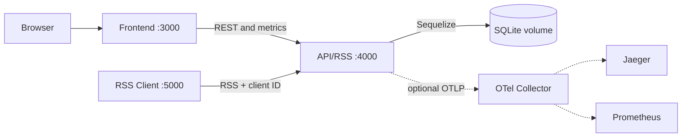

# La Trobe Content Distribution Hub

Assessment 3 extends the existing publishing and RSS system with persistent operational metrics, live dashboards, reporting, alerts, automated browser tests, load testing, accessibility evidence, and optional OpenTelemetry. Assessment 1 and 2 workflows remain intact: authors manage posts, Sequelize persists them in SQLite, the API publishes RSS 2.0, and a separate mock LMS client consumes it.

## What is included

- A publishing frontend with post CRUD, fixed Channels, database inspection, Dashboard, and Hub Intelligence.
- A Next.js API/RSS server backed by Sequelize migrations and a persistent SQLite volume.
- A separate RSS Client with a stable browser client ID sent on every feed request.
- Database-backed `RequestLog`, `FeedStatusEvent`, and `Alert` records.
- Summary, per-feed, per-client, time-series, recent-activity, status, and alert APIs.
- Playwright server/client journeys, a staged JMeter plan, and repeatable Lighthouse checks.
- Optional OpenTelemetry Collector, Jaeger, and Prometheus services.

The applications share TypeScript DTOs from `shared/`; [docs/openapi.yaml](docs/openapi.yaml) is the machine-readable HTTP contract.

## Assessment progression

- Assessment 1 established the responsive, accessible publishing interface and design system.
- Assessment 2 connected that interface to post CRUD, Sequelize/SQLite persistence, RSS Server routes, Docker Compose, and the separate RSS Client/mock LMS.
- Assessment 3 preserves those capabilities and adds persisted usage history, separate RSS student identities, operational status and alerts, Dashboard/Hub Intelligence, automated browser and load tests, accessibility evidence, and optional telemetry.

## Architecture and ports

| Service         | Purpose                                                     | Local URL             |
| --------------- | ----------------------------------------------------------- | --------------------- |
| `frontend`      | Publishing, Dashboard, Hub Intelligence, database inspector | http://localhost:3000 |
| `api`           | REST, RSS, metrics, alerts, migrations                      | http://localhost:4000 |
| `rss-client`    | Separate mock LMS RSS consumer                              | http://localhost:5000 |
| `sqlite`        | Named-volume holder for persistent API data                 | private               |
| `metrics-tools` | One-shot demo-data/reset utility (`tools` profile)          | private               |



Only the API and one-shot tools mount the database volume. The clients never access SQLite directly.

## Start locally with Docker (recommended)

Prerequisites: Docker Desktop with Compose v2 and Git.

```powershell
docker compose up --build -d
docker compose ps
```

Open http://localhost:3000, http://localhost:4000/health, and http://localhost:5000. Run the repeatable health, RSS, and API-restart persistence check with:

```powershell
powershell -ExecutionPolicy Bypass -File scripts/smoke-test.ps1
```

Normal restarts preserve data:

```powershell
docker compose restart api
```

`docker compose down -v` removes the named database volume and should only be used when a deliberately clean database is wanted.

## Start locally without Docker

Use Node.js 20.19.5. Install all dependency sets once:

```powershell
npm ci
npm ci --prefix api
npm ci --prefix frontend
npm ci --prefix rss-client
```

Then use three terminals from the repository root:

```powershell
npm run dev:api
npm run dev:frontend
npm run dev:rss-client
```

The API automatically migrates and seeds its local SQLite database. The same URLs and ports shown above apply.

## Dashboard and Hub Intelligence

The publishing-first Dashboard keeps post creation and Channel distribution central. **Hub Intelligence** at `/hubintelligence` is the premium analytics cockpit: automatically applying time, author, RSS student, Channel, result and source slicers; responsive chart buckets; contextual tooltips; live 30-second refresh; collapsible insight panels; and server-paginated request evidence with 20/100/500/1000-row pages. `/reports` redirects to the new URL for compatibility.

Metrics are derived from persisted records, not hard-coded totals. RSS responses remain available if metrics logging fails. `/count` remains a backwards-compatible count of successful RSS requests.

The RSS Client creates `latrobe-rss-client.id.v1` in local storage and sends its stable value through `X-Client-Id`; `X-Client-Source` identifies the caller type. Requests without an ID receive a safe anonymous fallback.

### Operational schema and metric definitions

- `RssUser` stores six seeded student viewers separately from publishing authors. `RequestLog` stores browser client ID, selected RSS user, feed identity, endpoint, method, HTTP status, success, duration, request time, source, and user agent. Indexes cover time, client, RSS user, feed, and success queries.
- `FeedStatusEvent` records each feed observation as `HEALTHY`, `EMPTY`, `WARNING`, or `ERROR`, including item count, HTTP status, latency, and message.
- `Alert` stores an unusual state, severity, feed, message, and resolved timestamps. Repeated matching failures reuse an unresolved alert instead of producing noise.
- Total requests count logs in the selected range; unique clients count distinct client IDs; feed count comes from the feed table; success rate is successful requests divided by total requests; average latency is the mean recorded duration; unresolved alerts count alert records whose resolved flag is false.
- A successful feed with items is healthy, a successful feed with no items is empty, 4xx responses are warnings, and 5xx/unexpected failures are errors. Failed RSS checks create a warning/error alert that can be resolved in Hub Intelligence.

## Operational API

All JSON endpoints use `{ "success": true, "data": ... }` or a predictable error envelope.

| Method  | Endpoint                                    | Purpose                                         |
| ------- | ------------------------------------------- | ----------------------------------------------- |
| `GET`   | `/api/metrics/summary?range=24h`            | KPI summary                                     |
| `GET`   | `/api/metrics/requests-by-feed?range=7d`    | Per-feed totals and latency                     |
| `GET`   | `/api/metrics/requests-by-client?range=7d`  | Per-client usage                                |
| `GET`   | `/api/metrics/requests-over-time?range=24h` | Time buckets for charts                         |
| `GET`   | `/api/metrics/recent?range=24h&limit=25`    | Recent request records                          |
| `GET`   | `/api/feed-status`                          | Latest status for every feed                    |
| `GET`   | `/api/alerts`                               | Alert list                                      |
| `PATCH` | `/api/alerts/:id`                           | Resolve or reopen an alert                      |
| `GET`   | `/health`                                   | API/database state, uptime, version, feed count |
| `GET`   | `/count`                                    | Compatibility successful-request counter        |
| `GET`   | `/rss`                                      | Five newest unique posts as RSS 2.0             |
| `GET`   | `/rss/:channelCode`                         | One Channel's RSS 2.0 feed                      |

The existing post CRUD, users, feeds, statistics, and compatibility routes are retained and documented in OpenAPI.

## Demonstration data and reset

For local Node development:

```powershell
npm run simulate:traffic
npm run reset:metrics
```

For the Docker/EC2 named volume:

```powershell
docker compose --profile tools run --rm metrics-tools npm run simulate:traffic
docker compose --profile tools run --rm metrics-tools npm run reset:metrics
```

Simulation is deterministic and replaces only prior simulated records. Reset clears operational history and the compatibility counter while preserving users, posts, feeds, and relationships.

## Verification

```powershell
npm run verify
npm run test:e2e
npm run test:a11y
powershell -ExecutionPolicy Bypass -File scripts/run-lighthouse.ps1 -Label before
powershell -ExecutionPolicy Bypass -File scripts/run-lighthouse.ps1 -Label after
```

- `verify` checks formatting, lint, 8 isolated API/RSS tests, and all production builds.
- Playwright uses an isolated SQLite database and starts its own applications. See [docs/testing/PLAYWRIGHT.md](docs/testing/PLAYWRIGHT.md).
- JMeter requires Java 17+ and Apache JMeter 5.6.3 on `PATH`. Its staged 1/10/100/1000/10000-user runner is `powershell -ExecutionPolicy Bypass -File tests/jmeter/run-stages.ps1`; parameters can override host, port, feed, and loops. The evidence procedure is in [docs/testing/JMETER.md](docs/testing/JMETER.md). High stages are deliberately opt-in and should run only on an appropriately sized environment.
- Lighthouse JSON/HTML reports are generated under ignored `docs/testing/results/`; the procedure is in [docs/testing/LIGHTHOUSE.md](docs/testing/LIGHTHOUSE.md).

Do not claim an unexecuted JMeter stage or Lighthouse result. Keep the raw generated evidence outside Git as configured by `.gitignore`.

Accessibility remains part of the shared UI design: semantic headings and tables, labelled controls and status text, keyboard-visible focus, modal focus management, reduced-motion support, responsive layouts, and chart data available without relying on colour or graphics alone.

## Optional observability

```powershell
docker compose -f docker-compose.yml -f docker-compose.observability.yml --profile observability up --build -d
```

Jaeger is at http://localhost:16686 and Prometheus at http://localhost:9090. This opt-in profile exports API traces and span metrics without replacing the assessed database metrics. See [docs/OBSERVABILITY.md](docs/OBSERVABILITY.md).

## EC2 deployment

Keep developing and verifying locally first. When the final commit passes, copy `ec2.env.example` to `ec2.env`, replace the placeholder host, and deploy:

```powershell
docker compose --env-file ec2.env -f docker-compose.yml -f docker-compose.ec2.override.yml up --build -d
```

The override publishes the frontend on TCP 80 and API on TCP 4080. The RSS Client remains private by default; expose it only if the marker must view it directly. In the EC2 security group, allow SSH 22 only from your IP, HTTP 80 from viewers, and 4080 only where the browser needs direct API access. Do not open all ports or expose SQLite. For production beyond assessment viewing, place the API behind an HTTPS reverse proxy and restrict 4080.

## Evidence and video

Use [talkingpoints.md](talkingpoints.md) for a concise recording sequence. Show the live publishing-first Dashboard, an RSS request changing Hub Intelligence, its filters and alert resolution, Playwright output, executed JMeter evidence, Lighthouse before/after reports, Docker health/persistence, optional traces, and the milestone Git history. Replace the ignored `frontend/public/video/assessment-demo.mp4` or configure `NEXT_PUBLIC_ASSESSMENT_VIDEO_URL`, then rebuild the frontend.

The audit and implementation rationale are recorded in [docs/ASSESSMENT_3_AUDIT.md](docs/ASSESSMENT_3_AUDIT.md).

## Workflow, limitations, and Assessment 4 readiness

Assessment 3 was delivered through focused `feature/a3-*` branches and milestone commits merged into `main`; GitHub Actions repeats formatting, lint, unit/integration tests, builds, and Playwright. Generated dependencies, SQLite files, browser reports, JMeter results, secrets, and video files remain ignored.

Known limitations are intentional: authentication and the LMS are mocked, client IDs identify browser installations rather than people, SQLite suits this single-instance assessment deployment but is not a horizontally shared database, in-process RSS logging is best-effort rather than a durable event queue, and telemetry is opt-in. These boundaries leave a clear Assessment 4 path toward real identity, HTTPS/domain routing, managed shared storage, retention policies, background event processing, and production alert delivery without prematurely adding Redis, Kafka, or another analytics database.
