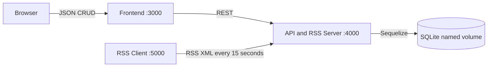
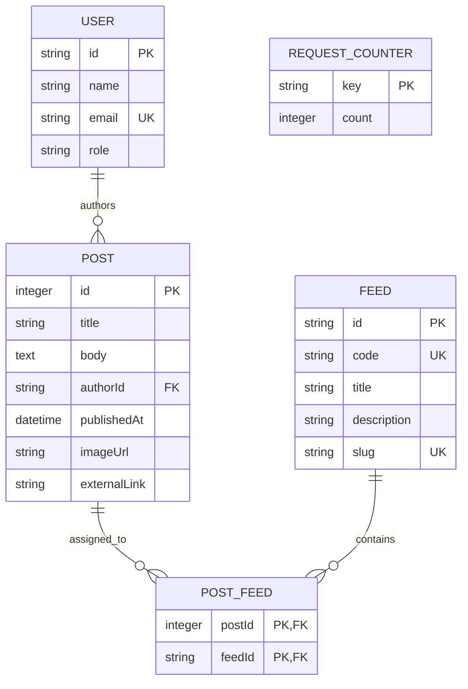

# La Trobe Content Distribution Hub

Assessment 2 is a backend-driven content distribution system. A Next.js publishing frontend creates and manages posts through a REST API, Sequelize persists them in SQLite, the API publishes RSS 2.0 feeds, and a separate RSS Client displays those feeds as a mock LMS.

The three applications import their API envelopes and DTOs from the local `@latrobe/api-contract` package in `shared/`. This keeps browser clients and API responses aligned with one TypeScript source of truth; `docs/openapi.yaml` is the machine-readable HTTP contract.

## Architecture

| Compose service | Responsibility                                                         | Technology                                | Local port |
| --------------- | ---------------------------------------------------------------------- | ----------------------------------------- | ---------: |
| `frontend`      | Publishing UI, dashboard, post reader and read-only database inspector | Next.js, React, TypeScript                |       3000 |
| `api`           | REST API, RSS Server, validation, migrations and SQLite ownership      | Next.js Route Handlers, Sequelize, SQLite |       4000 |
| `rss-client`    | Separate mock LMS that parses and displays RSS                         | Next.js, React, TypeScript                |       5000 |
| `sqlite`        | Lightweight holder for the named SQLite volume                         | BusyBox                                   |          — |

These are four services in one Docker Compose stack, not four services in one container. Each service runs in its own container on the private Compose network. Only the API mounts the database at `/app/data/content-hub.sqlite`; the RSS Client never accesses SQLite directly.



## Database schema

Versioned Sequelize migrations create the schema. Startup applies only migrations that have not previously been recorded in `SchemaMigrations`, then the idempotent seed adds the four demo users, eight fixed feeds, sample posts, relationships and request counter. Production startup does not use `sequelize.sync()`.



Foreign keys protect author and feed relationships. Join rows cascade when a post is deleted. Indexes cover publication dates, authors, feed codes/slugs and join-table lookup keys. The first migration also upgrades an earlier installation to the explicit `Feed`/`PostFeed` schema and removes the obsolete classification column without requiring the Docker volume to be deleted.

The UI calls feeds **Channels** because that is clearer to a publisher. The database calls them feeds because each record explicitly represents an RSS feed.

## API contract

JSON success responses use:

```json
{ "success": true, "data": {}, "meta": {} }
```

JSON errors use:

```json
{ "success": false, "error": { "code": "VALIDATION_ERROR", "message": "...", "details": {} } }
```

| Method   | Endpoint                                                  | Purpose                                                         | Success |
| -------- | --------------------------------------------------------- | --------------------------------------------------------------- | ------: |
| `GET`    | `/api/posts?page=1&pageSize=20&search=&authorId=&feedId=` | Paginated post list and filters                                 |     200 |
| `POST`   | `/api/posts`                                              | Create a post and feed relationships transactionally            |     201 |
| `GET`    | `/api/posts/:id`                                          | Read one post                                                   |     200 |
| `PATCH`  | `/api/posts/:id`                                          | Update content, author, publication date or feed relationships  |     200 |
| `DELETE` | `/api/posts/:id`                                          | Delete a post and cascade its join rows                         |     200 |
| `GET`    | `/api/feeds`                                              | Read the fixed feed catalogue                                   |     200 |
| `GET`    | `/api/users`                                              | Read demo authors                                               |     200 |
| `GET`    | `/health`                                                 | API and database health                                         | 200/503 |
| `GET`    | `/count`                                                  | Successful RSS request count                                    |     200 |
| `GET`    | `/stats`                                                  | Post/feed totals, latest post, per-feed totals and RSS requests |     200 |
| `GET`    | `/rss`                                                    | Five newest unique posts as RSS 2.0 XML                         |     200 |
| `GET`    | `/rss/:channelCode`                                       | All posts for one channel as RSS 2.0 XML                        | 200/404 |

The fixed feed catalogue is intentionally read-only. Posts provide the assessment's complete create, read, update and delete workflow.

Example create payload:

```json
{
  "title": "Industry placement applications open",
  "body": "Applications close Friday.",
  "authorId": "administrator",
  "feedIds": ["internships", "csit-news"],
  "publishedAt": "2026-08-10T01:00:00.000Z",
  "imageUrl": null,
  "externalLink": "https://example.com/apply"
}
```

Invalid JSON, malformed pagination, empty content, unknown authors, unknown feeds, invalid dates and non-HTTP URLs return predictable 400 responses. Missing posts or channels return 404. CORS is deliberately non-credentialed and permissive for this authentication-free assessment demonstration.

Compatibility aliases `/api/topics` and `/api/rss/topics/:channelCode` remain temporarily available for older assessment links, but all current applications use `/api/feeds` and `/rss/:channelCode`.

The machine-readable OpenAPI contract is in [`docs/openapi.yaml`](docs/openapi.yaml).

## RSS behaviour

- `http://localhost:4000/rss` returns exactly the five newest posts.
- `http://localhost:4000/rss/FRONTIERLLMS` returns only that channel.
- Successful combined and channel RSS responses increment the persistent `/count` value.
- RSS titles, descriptions, authors, dates, GUIDs, links and optional images are XML-escaped consistently.
- Each item links to the readable frontend page at `http://localhost:3000/posts/:id`.
- The standalone client loads a selected channel automatically and refreshes it every 15 seconds, with a spinner and countdown.

## Run with Docker

From a fresh clone:

```bash
docker compose up --build -d
docker compose ps
```

Expected URLs:

- Frontend: http://localhost:3000
- API: http://localhost:4000
- RSS Client: http://localhost:5000
- Health: http://localhost:4000/health
- Request count: http://localhost:4000/count
- Statistics: http://localhost:4000/stats

To deliberately remove all demonstration data and test a fresh migration/seed:

```bash
docker compose down -v
docker compose up --build -d
```

Do not use `down -v` for a normal restart. This preserves the named SQLite volume:

```bash
docker compose restart api
```

On Windows, the repeatable smoke test checks all three ports, health, RSS XML and persistence across an API restart:

```powershell
powershell -ExecutionPolicy Bypass -File scripts/smoke-test.ps1
```

## Local development and quality checks

```bash
npm ci
npm ci --prefix api
npm ci --prefix frontend
npm ci --prefix rss-client
npm run verify
```

`npm run verify` checks formatting, lints all three applications, runs isolated API/RSS tests and creates all three production builds. Tests use a temporary SQLite database and never modify Docker demonstration data. GitHub Actions runs the same quality gates on feature branches and pull requests.

Start applications without Docker in separate terminals:

```bash
npm run dev:api
npm run dev:frontend
npm run dev:rss-client
```

Migrations and the idempotent seed can also be run explicitly:

```bash
npm --prefix api run db:migrate
npm --prefix api run db:seed
```

## EC2 port override

Local development intentionally keeps `3000:3000`, `4000:4000` and `5000:5000`. The course diagram is represented by a separate override:

```bash
cp ec2.env.example ec2.env
docker compose --env-file ec2.env -f docker-compose.yml -f docker-compose.ec2.override.yml up --build -d
```

| Service    | Container port |      EC2 host port |
| ---------- | -------------: | -----------------: |
| Frontend   |           3000 |                 80 |
| API        |           3000 |               4080 |
| RSS Client |           5000 | private by default |

Allow inbound TCP 80 and 4080 in the EC2 security group. Port 5000 is optional. The browser-facing frontend uses the public API URL from `ec2.env`, while the RSS Client proxy reaches `http://api:3000` on Docker's private network.

## Submission workflow

Assessment work is developed on feature branches and reviewed by automated checks before merging to `main`. The final submission is tagged `assessment-2-final`. Generated dependencies, Next.js output, environment secrets, local SQLite files and video files are excluded from Git.
